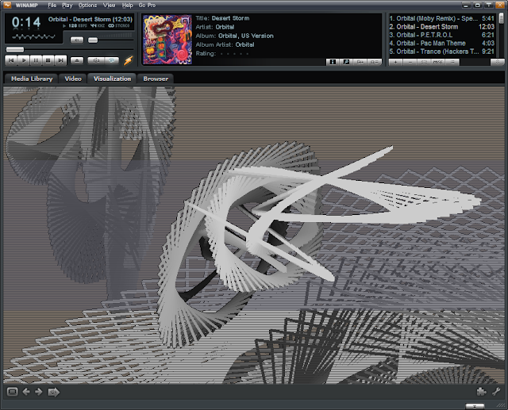

# Reliving the past - bringing dead software back to life

by _Jheriko_ / 27th October 2012

So, way back when I was, what became termed an
[AVS](http://en.wikipedia.org/wiki/Advanced_Visualization_Studio) artist. Something like
a VJ, but without the performance element - making procedural demos fed by audio data.
My work was widely downloaded on [Winamp.com](http://winamp.com/),
[deviantART](http://www.deviantart.com/), Deskmod and more, as well as featured in [PC
Format magazine](http://pcformat.techradar.com/).

VJ Chmutov - a collaboration with UnConeD and in many ways for me, symbolic of the
pinnacle of AVS.

One of the great sadnesses of AVS is that it has not been loved in a long time, and
basically crashes and burns on any modern OS, so I sat myself in-front of a machine with
good ol' Windows XP (under which it crashes, but not quite so badly - and at least
renders everything - sort of) so I can try and capture some screenshots and video so I
can actually show people what I used to do instead of alluding to it. Unfortunately my
luck with video was poor. Trying to make something small enough to get up onto YouTube
on that machine was not practical- and it really does need to be seen in motion to truly
appreciate. I'm going to keep working on that...

'Real-time' lighting with normals and such, with out hardware acceleration, but
f\*ck me that's ugly

Some of it was just tech demos, most of it was meant to be beautiful, and all of it was
great fun at the time. It was a great experience, allowing me to play with the
techniques we use today for cutting edge rendering - in the comfort of an easy scripting
environment (a very fast language - comparable with C when hand optimised - nothing like
the monstrosities of scripts we have today).

Way before bloom and HDR were things we talked about doing in real-time...

Recently I knocked out some kind of bastard AVS life support machine
[code](http://jheriko-rtw.blogspot.com/2012/10/resurrecting-avs.html) that allows it to
run standalone - spurred on by PAK-9 and [Jeremy Abel](http://jeremyabel.com/). It
always great fun coding something like this under time pressure with people watching. At
first glance it sounds a little crazy - taking a plug-in for a media player and running
it standalone - but the foo_vis_shpeck plugin for [foobar2000](http://foo_vis_shpeck/)
already does exactly this. Also, I have inside knowledge - I wrote APE plugins for AVS
way back when, have made Winamp plugins and also have access to the AVS source code. The
rest involves a tiny bit of reverse engineering and guesswork - but not much...

Plenty of good old fashioned line rendering

Particle systems and motion blurs

The key thing with attempting this project was understanding the plug-in interface. The
interface is a C struct, pure and simple - using a combination of function pointers and
data to feed the audio data into the plugin and get it to render inside the Winamp
provided host window. Knowing this made getting a simple rig up and running pretty
straightforward... the real fun began in fixing crashes and problems where Winamp was
supposed to provide something and I had no real way of knowing exactly what.

Sadly compiling my own version of vis_avs.dll to help was complicated by the use of the
MS resource mechanism for the UI, something which is vaguely unsupported by the various
Express editions of Visual Studio. Instead of using that kind of solution I went with
guesswork and trawling through disassembly - surprising how much you can work out from
the symbols of Windows API functions and the parameters being passed in. Particularly
the SendMessage function for reverse engineering the [IPC
call](http://en.wikipedia.org/wiki/Inter-process_communication) mechanism used by Winamp
and the plugin to communicate values where are not part of the interface struct.

Feeding in audio data and getting a spectrum for feeding in was fun. I introduced a bug
by copy-pasting some [Dr. Dobbs article code for the
FFT](http://www.drdobbs.com/cpp/a-simple-and-efficient-fft-implementatio/199500857) and
got a spectrum up and running pretty fast, but there are still issues with the lazy
audio streaming code now that I have handed it over for actual use... (16-bit mono PCM
please, otherwise I need to write more code!)

Currently Jeremy Abel is whipping up some kind of QT user interface for the thing which
I look forward to seeing in action as well... I've also written a quick PNG writing APE
since the PNG writing part of avs-rig proved problematic (too easy to trigger by
accident and not as ideal for actual use as an APE apparently).

Even more particle systems and line rendering

Lookup texture shading, particles and lines coupled with animated UVs

Anyway... that's enough pretty pictures for now. Hopefully the continued development of
offline-avs will see some interesting videos before long. Sadly I do not have a
high-spec machine with Windows XP and decent internet lying around to make one...  and
at least now I have a page filled with screenshots of a sampling of my past work.

You can find the source for offline-avs here:
[http://code.google.com/p/offline-avs/source/browse/#svn%2Ftrunk%2Fsrc%2Favs_rig](http://code.google.com/p/offline-avs/source/browse/#svn%2Ftrunk%2Fsrc%2Favs_rig)

**Do not follow it as an example in any way.**

_pngape_ is in one file called monolith.cpp - I guarantee you that dragons are waiting
inside.

_avs_rig_ itself was built in mere hours and with a vague design philosophy of using
files - one of which is called WaveFileThingy.cpp - again, use at your own risk, this is
some dirty code I ported from GLToy in minutes instead of doing it nicely.
